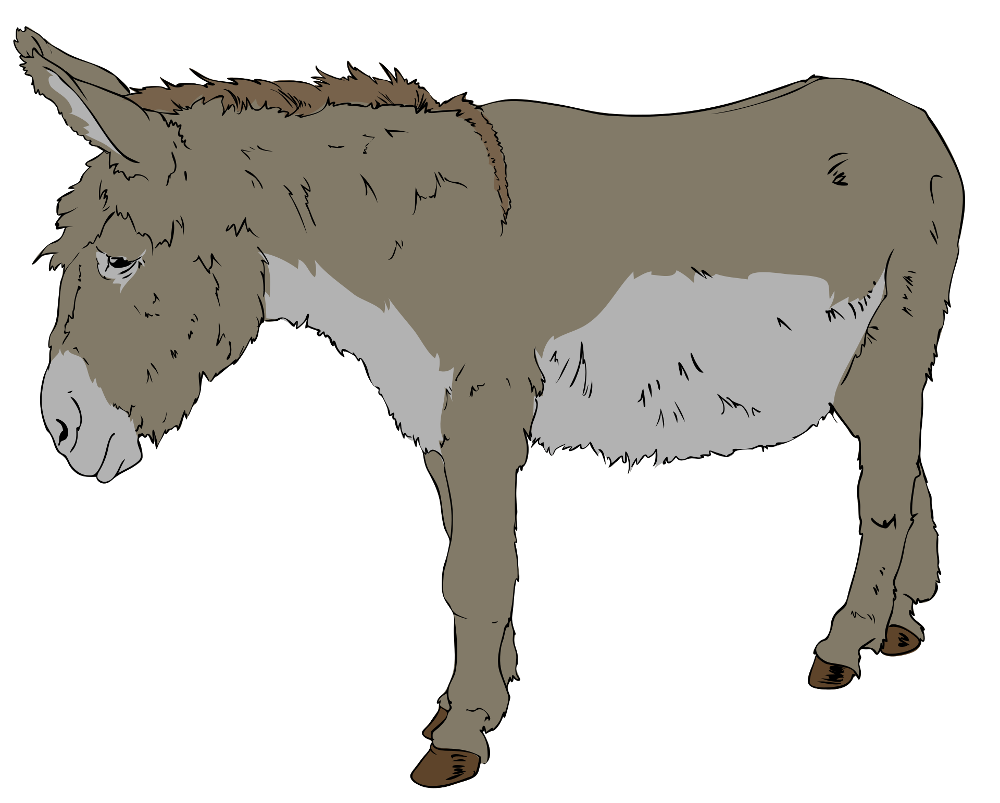

*a hidden state is worth a thousand words.*

<!--  -->

Hi! I am Bokai Xu, I received my bachelor degree at The Chinese University of Hong Kong, Shenzhen. Currently I am working as an engineer at ModelBest.

My passion is understanding the connection between deep neural networks and biological brain.

About my current research & work:

At [THUNLP@THU](https://nlp.csai.tsinghua.edu.cn/) aka [ModelBest Inc](https://modelbest.cn/) (Jun 2022 - ), I worked on various topics with large language models.

- contributed to language model alignment [UltraChat: Enhancing Chat Language Models by Scaling High-quality Instructional Conversations](https://github.com/thunlp/UltraChat), the dataset were widely used by community, including Falcon, Zephyr and others.

- contributed to [Tool Learning with Foundation Models](https://arxiv.org/abs/2304.08354) & [BMTools](https://github.com/OpenBMB/BMTools) for LLM to use tools, we thoroughly investigated the LLM's ability to sequentially use tools for completing various tasks.

- contributed to [MiniCPM-V-2.6](https://huggingface.co/openbmb/MiniCPM-V-2_6), in OCR capability and multi-image understanding capability.

- contributed to multimodal information retrieval [VisRAG](https://arxiv.org/pdf/2410.10594) & [VisRAG-Ret](https://huggingface.co/openbmb/VisRAG-Ret), in training and evaluation of VLM-based dense retrieval models, training data synthesis, and data filtering. VisRAG enables VLM to read and comprehend with vision and retrieve multimodal information, in a way like human.

<!-- - contributed to [MiniCPM-Embedding](https://huggingface.co/openbmb/MiniCPM-Embedding) in training and evaluation infrastructure of dense retrieval models. -->

At [ICBI@SIAT](https://icbi.siat.ac.cn/) (Apr 2023 - ), I worked on brain reconstruction infrastructures. I work closely with Dr.Chaoyu Yang and Prof.Pengcheng Zhou.

- led foundation model pretraining Masked Autoencoders with large-scale microscopic images then aligned pretrained model for trustful brain reconstruction task: [Brain Reconstruction by Self Supervised Semantic Stitching of Non-overlapping 3D Microscopic Image
](/assets/pdf/xu2023brain.pdf).

<!-- - My long-term aim is to build scalable pipelines to extract neuronal circuits from microscopic images. -->

<!-- --- -->
<!-- 
We will open-source some experimental models at [RhapsodyAI](https://huggingface.co/RhapsodyAI).
 -->
